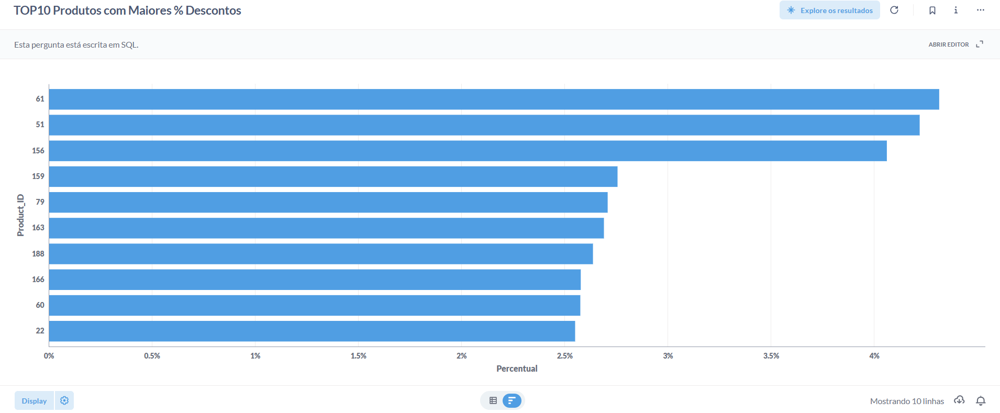

# 📊 TOP 10 Produtos com Maiores % de Desconto

Este repositório apresenta uma análise de dados realizada em **SQL**, utilizando o **Metabase** disponibilizado pela **Escola DNC**, com o objetivo de identificar os **10 produtos com as maiores porcentagens médias de desconto** aplicadas nos pedidos.

---

## 🧠 Contexto do Case

No contexto de negócios, compreender quais produtos recebem maiores descontos é essencial para:
- Avaliar estratégias comerciais e promocionais  
- Identificar possíveis impactos na margem de lucro  
- Apoiar decisões de precificação e campanhas futuras  

Este case responde à seguinte pergunta:

> **Quais são os 10 produtos que apresentam as maiores porcentagens médias de desconto em relação ao valor total dos pedidos?**

---

## 🛠️ Ambiente de Dados

- **Plataforma:** Metabase  
- **Disponibilizado por:** Escola DNC  
- **URL do ambiente:** https://dex.dnc.group/browse  
- **Banco de dados:** Educacional (DNC)

---

## 🗂️ Tabelas Utilizadas

### 📄 Orders
Tabela contendo informações de pedidos, incluindo:
- `Product_ID` – Identificador do produto  
- `Discount` – Valor de desconto aplicado  
- `Total` – Valor total do pedido  

> ⚠️ Observação: Apesar da tabela **Products** existir no ambiente, a análise foi realizada com base na tabela **Orders**, pois é nela que estão registrados os valores de desconto e total por pedido.

---

## 🧪 Query SQL Utilizada

```sql
SELECT 
    Product_ID,
    AVG(Discount / Total) AS Percentual
FROM Orders
GROUP BY Product_ID
ORDER BY Percentual DESC
LIMIT 10
```
---
## 🔍 Explicação da Query

- Calcula a porcentagem média de desconto (`Discount / Total`) por produto  
- Agrupa os dados por `Product_ID`  
- Ordena os produtos do maior para o menor percentual de desconto  
- Retorna apenas os 10 primeiros resultados  

---

## 📈 Visualização dos Resultados

O gráfico abaixo apresenta os **10 produtos com maiores percentuais médios de desconto**, facilitando a comparação entre eles.


## 🖥️ Dashboard 




---

## 📊 Principais Insights

- Alguns produtos apresentam **percentuais de desconto significativamente mais altos**, acima de 4%  
- A concentração de descontos elevados pode indicar:
  - Estratégias agressivas de venda  
  - Produtos com menor giro  
  - Necessidade de revisão de preço ou posicionamento  

Esses insights podem apoiar decisões estratégicas das áreas de **pricing, marketing e vendas**.

---

## 🚀 Tecnologias Utilizadas

- SQL  
- Metabase  
- Markdown  
---

## 👨‍💻 Autor

Projeto desenvolvido como parte de estudos em **Análise de Dados**, utilizando ambiente educacional da **Escola DNC**.

---

## 📌 Observações Finais

Este projeto tem fins **educacionais**, demonstrando habilidades em:

- Escrita de queries SQL  
- Análise exploratória de dados  
- Comunicação de insights por meio de visualizações  

